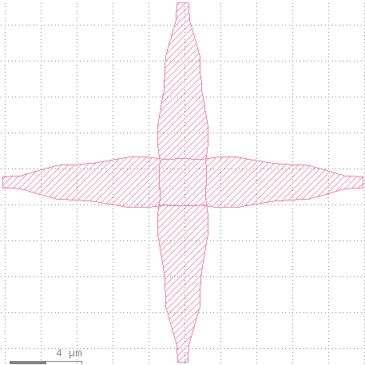

# TFLN O-Band Waveguide Crossing PDK

## Description:

A TFLN O-band waveguide crossing designed by Professor David V. Plant's group at McGill University and fabricated by HyperLight as part of their multi-project wafer service. The input and output ports are 600 nm (w) x 250 nm (h) single mode waveguides.

Questions should be addressed to:
[benton.qiu@mail.mcgill.ca](mailto:benton.qiu@mail.mcgill.ca)

Read more about this device: TBD

Citation: TBD

## Device
[Download the GDS layout file](CrossingGDS.gds?raw=1)

